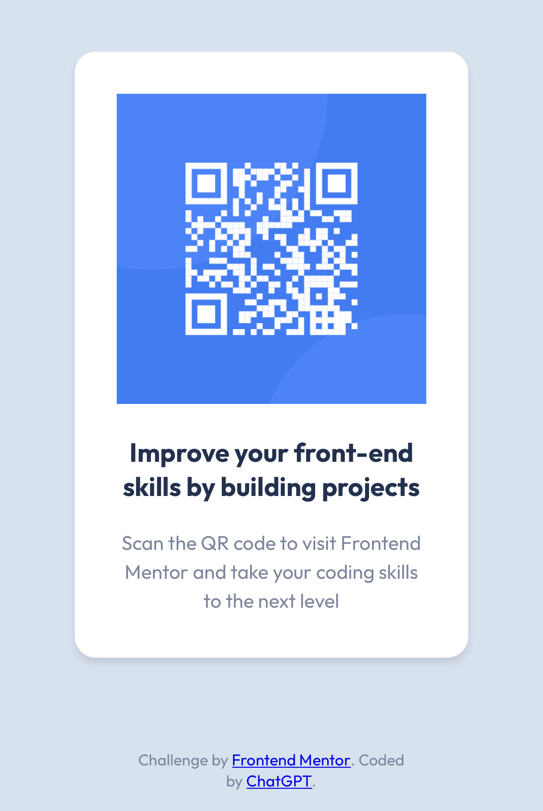

# Frontend Mentor - QR code component solution

This is a solution to the [QR code component challenge on Frontend Mentor](https://www.frontendmentor.io/challenges/qr-code-component-iux_sIO_H). Frontend Mentor challenges help you improve your coding skills by building realistic projects. 

## Table of contents

- [Overview](#overview)
  - [Screenshot](#screenshot)
  - [Links](#links)
- [My process](#my-process)
  - [Built with](#built-with)
  - [What I learned](#what-i-learned)
  - [Continued development](#continued-development)
  - [Useful resources](#useful-resources)
- [Author](#author)
- [Acknowledgments](#acknowledgments)

## Overview

### Screenshot




### Links

- Solution URL: [QR Code Component Solution](https://github.com/satchitanand/000_QR_Code_Component)
- Live Site URL: [QR Code Component Site](https://satchitanand.github.io/000_QR_Code_Component/)

## My process

### Built with

- Semantic HTML5 markup
- CSS custom properties
- Flexbox
- Mobile-first workflow

### What I learned

During this project, I learned how to create a responsive design using mobile-first workflow. I used Flexbox to position elements and practiced using media queries to adjust the layout for different screen sizes.

I also learned how to fix issues with image paths and troubleshoot broken images, ensuring that all assets are displayed correctly.

```html
<div class="qr-code-container">
  
</div>
```

```css
.qr-code-container {
  display: flex;
  justify-content: center;
  align-items: center;
  width: 100%;
  background-color: hsl(0, 0%, 100%);
}
```

### Continued development

I plan to continue working on responsive designs and practicing mobile-first development. I also want to explore other CSS layout techniques, such as CSS Grid, to further improve my understanding of web layouts.

### Useful resources

https://chat.openai.com/

## Author

- Website - [Anand Ramachandran](https://github.com/satchitanand)
- Frontend Mentor - [@satchitanand](https://www.frontendmentor.io/profile/satchitanand)

## Acknowledgments

https://chat.openai.com/
